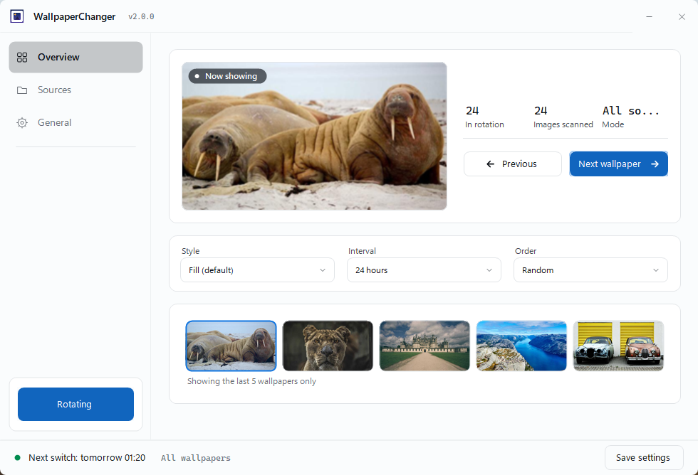

# WallpaperChanger 壁纸轮换

一款常驻系统托盘的 Windows 桌面壁纸轮换小工具。选择一个或多个文件夹作为壁纸源，设定铺放样式和切换间隔，自动轮换——或使用全局快捷键随时切换。

技术栈：C# / .NET 8（WinForms），自包含单文件，无需安装 .NET 运行库。支持 Windows 8 及以上系统（推荐 Windows 10/11 x64）。



## 界面

整个程序只有**一个窗口**，左栏三页：

| 页 | 内容 |
|---|---|
| **概览** | 当前壁纸预览与统计；铺放样式 / 切换间隔 / 图片顺序三个下拉框（直接改，即时生效）；底部一条历史缩略图带 |
| **壁纸源** | 源列表（启用开关 / 名称 / 路径 / 张数 / 删除）、添加文件夹、手动挑选壁纸 |
| **常规** | 开机自动启动、浅色 / 深色主题、界面语言、全局快捷键、配置与日志位置 |

左栏底部是一个大按钮，显示当前状态（**轮换中** / **已暂停**），点它即可切换。

## 功能特性

- **多文件夹壁纸源，可逐个禁用** — 所有**已启用**来源的图片合并进同一个轮换池。「壁纸源」页列出每个源及其壁纸数量（递归统计、含子文件夹），支持添加 / 删除 / 单独禁用：禁用的源只是暂时不参与轮换，图片与勾选记录都保留，重新启用即恢复
- **6 种铺放样式** — 填充 / 适应 / 拉伸 / 平铺 / 居中 / 跨屏（支持多显示器同图）
- **8 档切换间隔** — 1 / 5 / 10 / 30 分钟，1 / 6 / 12 / 24 小时。下次切换时间在底部状态栏显示；间隔跨天时会带上日期（如「明天 22:00」）
- **随机 / 顺序**两种轮换方式
- **多显示器** — 所有屏幕同步应用同一张壁纸
- **亮色 / 暗色主题** — 「常规」页一键切换并立即记住，整个窗口与托盘右键菜单一起跟随
- **全局快捷键**（主键盘**和小键盘**都支持），在「常规」页点按键框后按下组合键即可改绑：
  - `Ctrl+9` — 下一张壁纸
  - `Ctrl+8` — 上一张壁纸（按本次会话的应用历史逐级回退；回退后再按 `Ctrl+9` 会先回到刚离开的那张）
- **历史缩略图带** — 概览页底部横排显示**最近 5 张**壁纸的缩略图，只有图片、没有文件名；当前正在显示的那张带蓝色描边。点任意一张即可跳回
- **手动壁纸选择** — 精确圈定参与轮换的壁纸：「壁纸源」页点**手动挑选壁纸**，在 16:9 缩略图网格里勾选（支持文件名实时筛选，全选 / 全不选 / 反选作用于筛选结果；有多个壁纸源时顶部还有源筛选器，再次打开默认停在"已选中的壁纸"视图）。勾选了壁纸就开启手动模式，全部取消勾选即关闭；启用后，定时轮换和"下一张"只从勾选集合里挑。勾选状态重启后保持，新增图片默认未勾选
- **托盘常驻** — 右键托盘图标可 暂停 / 下一张 / 上一张 / 手动壁纸选择 / 打开主界面 / 退出；关闭窗口只是最小化到托盘
- **开机自启**（可选）— 开机时直接收进托盘、不弹出窗口；之后再次启动程序只是把已有窗口唤到前台
- **支持格式** — jpg / png / jfif / bmp / webp / gif / tiff；自动跳过 `Thumbs.db` 和损坏图片
- 中 / 英 / 日 三语界面。铺放样式、间隔、顺序改动后需点**保存设置**写入配置；语言与主题属于即时生效，点选即存
- 窗口为固定尺寸（980×668），不能最大化或拖拽缩放——内容按设计稿固定坐标排布

## 下载安装

到 [Releases](../../releases) 页面下载最新安装包（`WallpaperChanger-Setup.exe`，中文安装向导，适用于 Windows 10/11 x64）。重复安装即覆盖升级，已有配置会保留。

应用为自包含发布，**无需安装 .NET 运行库**。

> 当前版本：**v2.0.3**（界面完全重构）

## 使用说明

1. 启动 WallpaperChanger（默认最小化到托盘，点托盘图标可唤出窗口）。
2. 切到**壁纸源**页，点**添加文件夹**加入图片目录；每行可开关、可删除。
3. 回到**概览**页，用三个下拉框选好铺放样式、切换间隔和图片顺序，点右下角**保存设置**。

**新增壁纸何时生效**：程序不做实时文件监听，而是在每次切换动作（定时轮换 / `Ctrl+9` / 下一张壁纸按钮）时现场重新扫描源目录——往文件夹里丢入新图后，下一次切换就会把它纳入轮换池；想立即生效就按一下 `Ctrl+9`。`Ctrl+8` 上一张属于纯历史回退，不触发重新扫描。

配置与日志：exe 所在目录可写时写在同目录，否则自动写入 `%LocalAppData%\WallpaperChanger\`（安装到 Program Files 时即此路径）。路径可在**常规 → 配置与日志**里直接打开。

## 从源码构建

需要 .NET 8 SDK：

```bash
dotnet publish -c Release -r win-x64 --self-contained true \
  -p:PublishSingleFile=true \
  -p:IncludeNativeLibrariesForSelfExtract=true \
  -p:EnableCompressionInSingleFile=true \
  -o dist_standalone
```

安装包由 Inno Setup 生成（`installer/WallpaperChanger.iss`），需要先完成上面的发布。

## 开源协议

MIT


